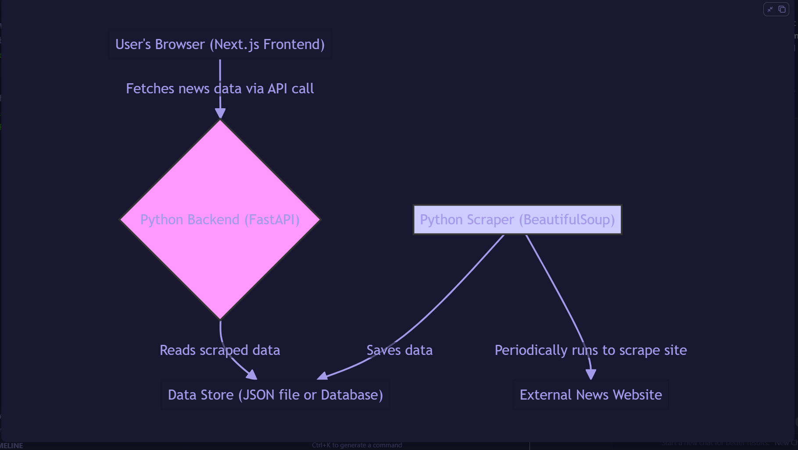

# Technical Documentation: NEWS Portal

This document provides a technical overview of the NEWS Portal application, detailing its architecture, components, and data flow. It is intended for developers working on or maintaining the project.

## 1. High-Level Architecture

The application is a monorepo composed of two main parts: a **Python FastAPI Backend** and a **Next.js Frontend**.

### Data Flow

1.  **Scraping**: A Python script (`scraper.py`) periodically scrapes the CNN website for news articles.
2.  **AI Categorization**: As articles are scraped, they are passed through an AI service (`ai_categorizer.py`) which uses the OpenAI API (GPT-3.5-turbo) to assign a relevant category from a predefined list.
3.  **Data Storage**: The scraped and categorized articles, along with metadata like a `publishedAt` timestamp, are stored in a simple JSON file (`news_data.json`), which acts as the application's database.
4.  **API Layer**: The FastAPI backend (`main.py`) serves this data through a REST API. It provides endpoints for fetching all news, news by category, search, and sorting.
5.  **Frontend Consumption**: The Next.js frontend consumes the API endpoints to display the news to the user. It uses Server-Side Rendering (SSR) for initial page loads and client-side navigation for subsequent interactions.

---

## 2. Backend Deep Dive (FastAPI)

The backend is responsible for data acquisition, AI processing, and serving the content.

### Project Structure (`/backend`)

- `main.py`: The core FastAPI application, defining all API endpoints and the startup logic.
- `scraper.py`: The web scraping script that gathers news from CNN.
- `ai_categorizer.py`: A module that interfaces with the OpenAI API to categorize articles.
- `news_data.json`: A file that stores the array of scraped article objects.
- `.env`: Stores the `OPENAI_API_KEY` and other environment variables.
- `requirements.txt`: Python package dependencies.

### Core Components

#### `scraper.py`

- Uses the `requests` and `BeautifulSoup` libraries to fetch and parse HTML from CNN's homepage and category pages.
- Extracts the article title, URL, image URL, and a brief description.
- **Crucially, it adds a `publishedAt` field with the current UTC timestamp (ISO format) when the article is scraped.** This is used for date-based sorting.
- The main function, `run_full_scrape()`, can be configured to pass the scraped articles to the AI categorizer.

#### `ai_categorizer.py`

- Uses the `openai` library to connect to the GPT API.
- The `categorize_article()` function constructs a prompt that asks the model to classify an article's title and description into one of several `PREDEFINED_CATEGORIES`. This ensures consistency.
- The `categorize_articles_batch()` function efficiently processes a list of articles.
- It includes fallback logic to assign a "general" category if the API fails or returns an unexpected value.

#### `main.py`

- **Startup Event**: On application startup (`@app.on_event("startup")`), it automatically runs the `ai_categorizer` on any articles in `news_data.json` that haven't been categorized yet.
- **API Endpoints**:
  - `/api/news`, `/api/news/all`, `/api/news/category/{category_name}`, and `/api/search` are the primary endpoints for fetching news.
  - **Sorting Logic**: All of these endpoints accept an optional `sortBy` query parameter which can be `newest`, `oldest`, or `relevance` (default). A `sort_articles()` helper function handles the sorting logic based on the `publishedAt` field.
  - `/api/ai/*`: A set of endpoints for manually triggering AI categorization, checking the AI status, and getting category statistics from the admin dashboard.

---

## 3. Frontend Deep Dive (Next.js)

The frontend is a modern React application built with Next.js, responsible for rendering the UI and handling user interactions.

### Project Structure (`/frontend`)

- `app/`: The core of the application, using the Next.js App Router.
  - `page.tsx`: The homepage.
  - `category/[category]/page.tsx`: Dynamic page for displaying articles of a specific category.
  - `search/page.tsx`: The search results page.
  - `admin/page.tsx`: A dashboard for managing backend processes.
- `components/`: Reusable React components.
  - `Header.tsx`: The main site navigation. Dynamically fetches categories from `/api/categories` to build its links.
  - `NewsCard.tsx`: Displays a single news article.
  - `SortBy.tsx`: The client-side component for handling sort functionality.
- `lib/newsApi.ts`: A service module that centralizes all API calls to the backend.

### Core Concepts & Components

#### Server Components & Data Fetching

- The primary pages (`page.tsx`, `category/[category]/page.tsx`, `search/page.tsx`) are **React Server Components**.
- They are `async` functions that fetch data directly from the backend API using `newsService` during the server-rendering process.
- They read URL parameters (e.g., `searchParams` for `q` and `sortBy`) to request the correct data from the API. For example, `search/page.tsx` reads `searchParams.sortBy` and passes it to `newsService.searchNews()`.

#### `SortBy.tsx` Component

- This is a **Client Component** ("use client").
- It uses Next.js hooks: `usePathname()` to get the current URL path (e.g., `/search`) and `useSearchParams()` to get the current query parameters (e.g., `q=tech`).
- When the user selects a new sort option, the `handleSortChange` function:
  1.  Creates a new `URLSearchParams` object from the current ones.
  2.  Sets or deletes the `sortBy` parameter.
  3.  Uses `router.push()` from `useRouter()` to navigate to the new URL (e.g., `/search?q=tech&sortBy=newest`).
- This navigation triggers Next.js to re-render the corresponding Server Component on the server with the new `searchParams`, which in turn re-fetches the data with the correct sorting.

---

## 4. End-to-End Workflow Example

**Scenario**: A user searches for "technology" and sorts the results by "newest".

1.  **Initial Search**:

    - The user types "technology" into the search bar on the `SearchClient` component.
    - `onSubmit`, the `handleSearch` function calls `router.push('/search?q=technology')`.
    - The `SearchPage` server component (`/app/search/page.tsx`) is rendered on the server.
    - It reads `searchParams` and sees `q: 'technology'`.
    - It calls `newsService.searchNews('technology', 'relevance')`.
    - The backend API at `/api/search?q=technology` is hit. It filters `news_data.json` for the query and returns the results in their default order.
    - The results are rendered in the `SearchClient` component.

2.  **Sorting**:
    - The user now sees the `SortBy` dropdown above the results.
    - They select "Published Date (newest first)".
    - The `handleSortChange` function in the `SortBy` component is triggered.
    - It gets the current path (`/search`) and query params (`q=technology`).
    - It constructs the new URL: `/search?q=technology&sortBy=newest`.
    - It calls `router.push('/search?q=technology&sortBy=newest')`.
    - The `SearchPage` server component is re-rendered on the server with the new `searchParams`.
    - It now calls `newsService.searchNews('technology', 'newest')`.
    - The backend API at `/api/search?q=technology&sortBy=newest` is hit. This time, the `sort_articles` function on the backend sorts the filtered results by the `publishedAt` field in descending order.
    - The newly sorted articles are passed to the `SearchClient` component and displayed to the user.

This architecture leverages the power of Next.js server components for efficient data fetching and SEO, while using client components for rich, interactive UIs like the sort dropdown.
